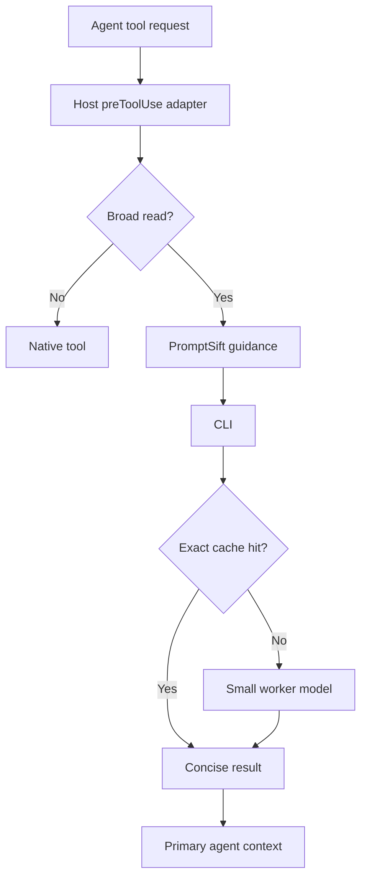

# Architecture

PromptSift separates policy, transport, and host integration so each can evolve independently.

## Components

### Host adapters

Cursor and Copilot send different payloads and expect different decisions. The hook layer normalizes both inputs into the same policy evaluator and emits the host's native response schema.

The checked-in runner is intentionally small and fail-open. It locates a project or global PromptSift binary and forwards stdin. If the package is missing or crashes, the original tool call is allowed and a warning is written to stderr.

### Policy evaluator

The evaluator uses both file line count and byte size. This catches normal large source files as well as minified or generated one-line files. Direct partial reads pass when their declared limit stays below `maxTargetedLines`.

Shell parsing is implemented without executing the command. It tokenizes quotes, escapes, command separators, pipes, and redirects, then evaluates relevant segments. Reducing pipelines and output redirects are not treated as full context reads.

### Worker transport

The worker client speaks the OpenAI-compatible chat-completions protocol. This keeps provider selection in configuration and supports local inference without a separate server owned by PromptSift.

File bodies use content-derived boundary markers and are explicitly declared untrusted. Credential-looking paths and binary files are rejected before payload construction.

### Cache and metrics

Read cache keys contain the prompt version, provider endpoint, model, reasoning effort, temperature, exact question, normalized paths, and content hashes. A changed file or question cannot reuse a stale answer.

Metrics are append-only JSONL. They deliberately distinguish primary-context savings from worker usage. When a provider does not report tokens, primary savings remain an estimate based on bytes.

### Code generation

Generation requires a reference file. The model output is fully received before any filesystem mutation. New targets use exclusive creation; replacements require `--force` and use a temporary file followed by rename. Only a single outer markdown fence is removed.

## Failure modes

- Hook runner missing package: allow the native tool and warn.
- Hook parser cannot identify a file: allow the native tool.
- File missing or unreadable: allow the native tool to report its own error.
- Worker unavailable: fail the explicit `read` or `write` command without changing targets.
- Target already exists: stop before contacting the worker unless `--force` is explicit.
- Cache entry invalid: treat it as a miss.
